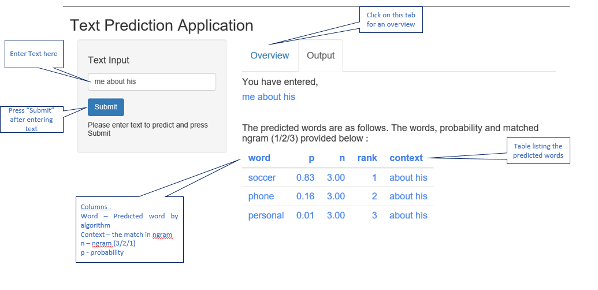

Final Project: TEXT PREDICTION
========================================================
author: Manoj Krishna
date: 25.March.2018
autosize: true

First Slide
========================================================
This presentation has been prepared as part of the Capstone project submission of Coursera Data Science. The assignment was to build a prediction algorithm and create a product which leverages the same to predict the next word.    

The assignment consists of the below two deliverables :     

- (A) Shiny App which takes text as input and predicts the next word    
- (B) Presentation of 5 slides (using R Studio Presenter) covering algorithm and how to use the app          
This presentation addresses deliverable (B).      

Model has been prepared from 10% of the sample data set provided (SwiftKey) across blog, news and twitter feeds    

Slide With Code
========================================================
**Model**   
- Ngram (uni, bi & tri) built using R packages which provides -  tokens  &  frequency        
- Prepare model from NGram with the following :  
     -  context (token without last word - to be matched with the input text in prediction)    
     -  word (last word of the token - would be returned as predicted word)    
     -  ngram (1/2/3 to indicate uni, bi or tri gram)    
     -  probability (frequency for word & context / frequency for context)    

Slide With Plot
========================================================
    
**Algorithm**    
- Pre-process input string using same steps as in model preparation    
- Match starting with NGram = 3 and go down to 1. Limit to 3 entries with highest probability        
    - NGram = 3 : last two words from input text ==  context, sort by probability    
    - NGram = 2 : last  word from input text == context, sort by probability    
    - NGram = 1 : pick top 3 words (context is NULL), sorted by probability        
- Return the list of word matched by above logic. Maximum of 3 entries would only be shown   

Slide With Plot
========================================================
The shiny app UI and usage detailed below :     

ShinyApp available at <https://mkrishna.shinyapps.io/predictnxtword/>  
